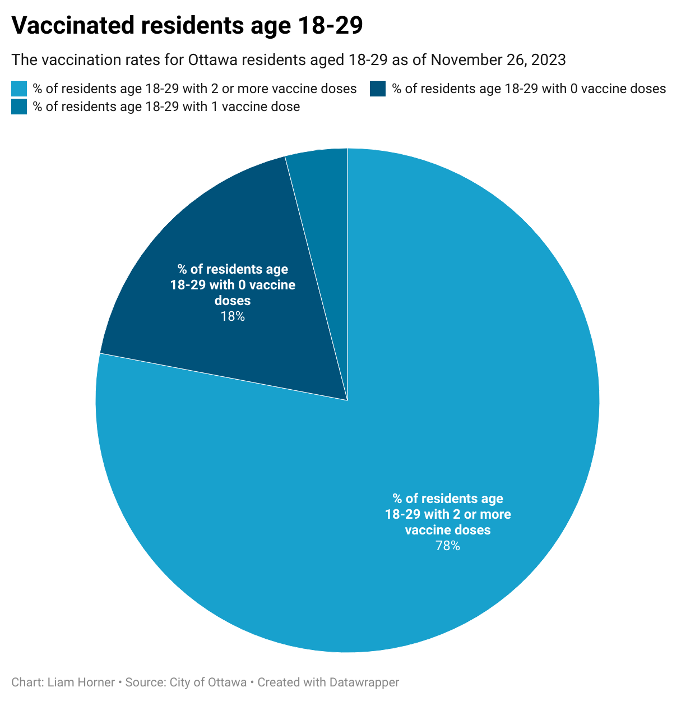
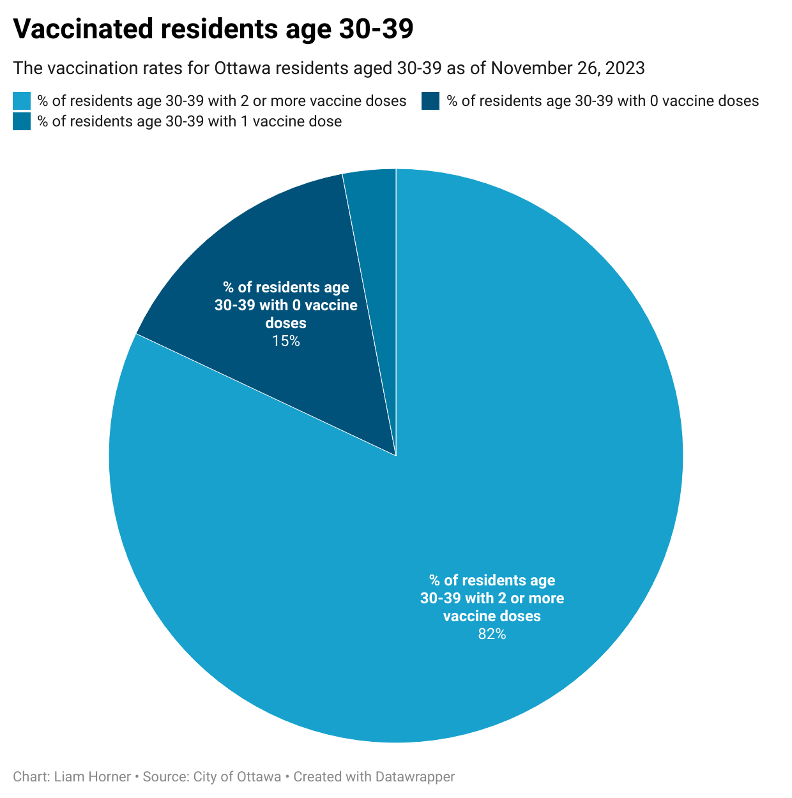
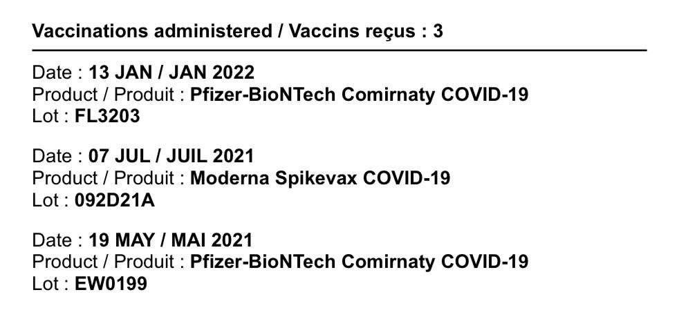
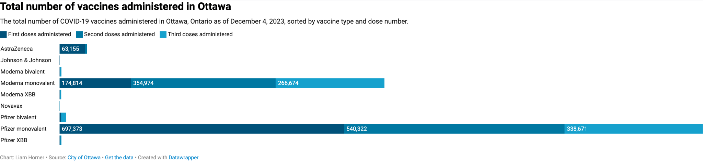
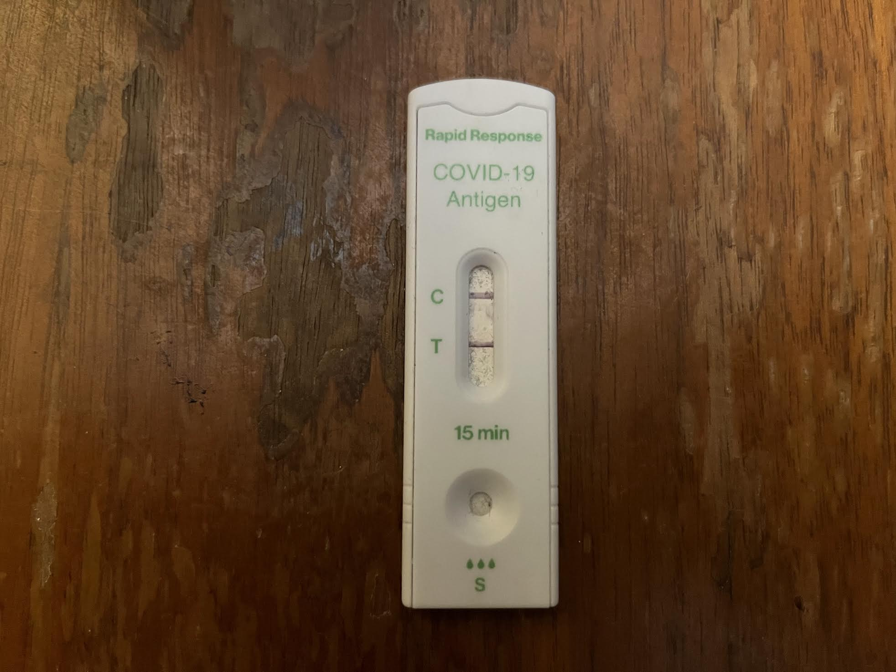

**20 December 2023** 
**MPAD2003A Introductory Data Storytelling** 
**John Zhang, Ethan Murphy-Spack, Liam Horner** 
**Presented to Jean-Sébastien Marier** 

# Final Project: The Miracle Cure - A Story From Ottawa

## A dive into the question of why young adults are less vaccinated for COVID-19 than teenagers and children in Ottawa.

### 1. Introduction

The COVID-19 virus infected hundreds of millions of people worldwide and was a huge wake-up call to many individuals and governments about the threat and consequences of a global pandemic. Many countries quickly enforced strict quarantines that lasted upwards of nearly eight months. It was not long after the first of many quarantines that a vaccine was finally produced and made publicly available. To get this vaccine out of the lab and into the arms of the general population, vaccine clinics opened up in various places around the world including shopping centres, drug stores and community centres. One of which was at the Richmond Arena in Ottawa Ontario. Just like most clinics that opened up, Richmond Arena consistently had lineups down the block with people eagerly awaiting their next dose with the hopes of returning to work, school and life before the pandemic. 

*Figure 1: RICHMOND MEMORIAL COMMUNITY CENTIRE.*

While it was heavily encouraged by the Canadian government for people to keep up to date with their vaccine doses and boosters, with the hopes of slowing and eventually ending the spread of the COVID-19 virus, some age groups were seen as more at-risk than others. This meant a much higher percentage of elderly citizens got vaccinated earlier than younger individuals. However, even after a significant amount had passed since the vaccine became available, it seemed that as age groups increased, so did the percentage of vaccinated individuals in that group. Eva Sheahan, a former worker of the vaccine clinic at Richmond Arena, stated during an interview that thinks “age five to twenty” was her least common, in terms of the age group to which she administered the vaccine.

*Figure 2: The volunteer interviewee Eva Sheahan*

### 2. Anaylsis of Different Age Groups People Who Are Vaccinated

After carefully analyzing and cleaning select data from the datasets “COVID-19 Vaccine Coverage by Day by Age by Dose for Ottawa Residents” and “COVID-19 Vaccine Administration by Vaccine Type and Dose in Ottawa”, both found on the open.ottawa.ca website, we noticed a small discrepancy in the pattern mentioned previously. While the general trend did show an increase in vaccinated individuals as age groups increased, the jump from 12-17 to 18-29 showed a surprising decrease in vaccinated individuals with both one and two or more vaccines. This observation first sparked our vision for the story we wish to tell. Using our cleaned data, we created a couple of charts that highlight this trend, while showcasing the outlier mentioned above.

* [The link to the original dataset of Vaccine Coverage by Day by Age by Dose for Ottawa Residents](https://open.ottawa.ca/datasets/ottawa::covid-19-vaccine-coverage-by-day-by-age-by-dose-for-ottawa-residents/explore)

*Figure 3: [The chart of age 12-17 vaccinated residents](https://datawrapper.dwcdn.net/Wugf0/1/)*

*Figure 4: [The chart of age 18-29 vaccinated residents](https://datawrapper.dwcdn.net/wah0D/1/)*

*Figure 5: [The chart of age 30-39 vaccinated residents](https://datawrapper.dwcdn.net/O1Vc2/1/)*

While the difference may seem relatively small with only a six percent drop from one age group to the next, that seemingly small percentage represents a large number of individuals, posing the question of what the reason behind this drop might be. After some thorough brainstorming sessions, we were able to come up with a few hypotheses, though the true answer is likely some combination of them all. Our first thought was that 18-29 year-olds have most likely moved out, and no longer spend as much time with their parents or other at-risk individuals, while 12-17 year-olds surely do. Another factor, closely linked with the one mentioned above, may be parental influence. Whether it may be a personal choice, or out of laziness to make and show up to an appointment, having a parent or guardian to tell you how and when you will be getting vaccinated almost certainly plays a role. While we struggled to go about graphing these variables, we did find one last reason we thought we should take into account, which lends itself nicely to visualizing graphically, vaccine type.

*Figure 6: Vaccinated Passport*

### 3. Anaylsis of The Different Effects The  Different Type of Vaccins Might Cause

The type of vaccine may have more of an impact than one might think after looking at different variables such as the availability of particular brands in Ottawa for different age groups. COVID being a respiratory condition, means that certain people with pre-existing medical conditions and older or younger people will be considered more at-risk, and would be at a higher priority to receive the vaccine. In Ottawa specifically, this was very much the case, and certain vaccine brands were available to the previously mentioned at-risk people, much earlier than the rest of the population. Then, the same vaccines were offered in order of oldest to youngest age groups, leaving young adults at the bottom of the list, being the least at-risk. Since each municipality only has access to a limited number of vaccines, by the time the 18-29 age group qualified to receive their vaccine, not as many doses were left in the city's stock. Vaccines must be allocated proportionally to the population of a city, and this sometimes leads to a shortage for some groups of people.

* [The link to the original dataset of Vaccine Type and Does in Ottawa](https://open.ottawa.ca/datasets/ottawa::covid-19-vaccine-administration-by-vaccine-type-and-dose-in-ottawa/explore)

*Figure 7: [The Chart of the total number of vaccines administered in Ottawa](https://datawrapper.dwcdn.net/IYijQ/6/)*

As we briefly mentioned above, we think that the full truth behind the drop in vaccine rates from the 12-17 age group to the 18-29 age group, is likely due to several factors such as the ones we listed. Hopefully, one day, if it hasn't already, this topic will be looked into at length by the federal government in hopes that we, as a community, along with many other communities, will be better prepared to ensure more members of society are motivated and willing to get their vaccine. “Being fully vaccinated myself and working in the customer service industry, I have seen many different age groups with varying perspectives and stances on whether or not vaccines should be mandatory” says Tahlia Farr, a fourth-year Biology student at Carleton University.

*Figure 8: The volunteer interviewee Tahlia Farr*

### 3. Conclusion

In the event of another global pandemic, we think it is of the utmost importance that Canadian citizens, of all age groups, are sufficiently informed and educated on why getting vaccinated is so beneficial to the population for reasons such as herd immunity. Any doubts, possibly stemming from misinformation about the vaccine's effects and side effects, may also be squashed if individuals understanding of vaccines and their effects continues to increase. Solutions to this could include pamphlets or demonstrations in schools, vaccine clinics and pharmacies discussing the science behind vaccines. COVID is still very relevant in our lives today, despite numerous quarantines and vaccines given out to the people of Ottawa. It is safe to say, beyond a shadow of a doubt, that we have learned a great deal regarding a global pandemic, and hopefully, in the event of another in our lifetimes, we will be even better prepared.

*Figure 9: The positive covid test bar from Liam Horner*

### 4. References

Cairo, C. (2016). The Truthful Art: Data, Charts, and Maps for Communication. New Riders. 

“COVID-19 Vaccine Administration by Vaccine Type and Dose in Ottawa”. City of Ottawa.  (2023). https://open.ottawa.ca/datasets/ottawa::covid-19-vaccine-administration-by-vaccine-type-and-dose-in-ottawa/explore

“COVID-19 Vaccine Coverage by Day by Age by Dose for Ottawa Residents”. City of Ottawa. (2023). https://open.ottawa.ca/datasets/ottawa::covid-19-vaccine-coverage-by-day-by-age-by-dose-for-ottawa-residents/explore

Eva, S. (2023). Personal interview.

Tahlia, F. (2023). Personal interview.

